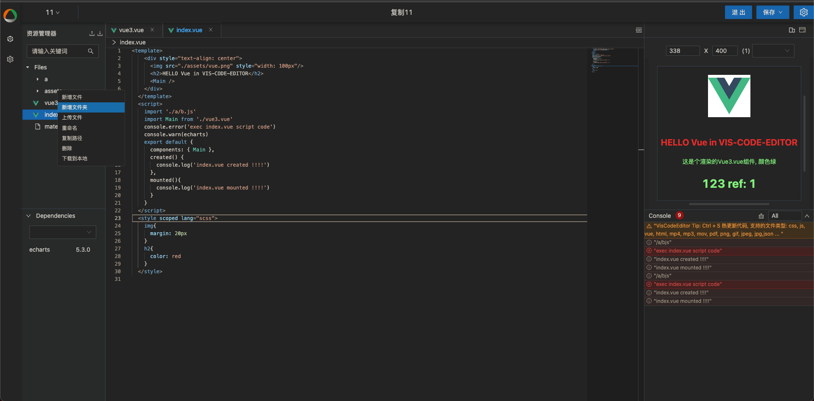

# react-browser-loader
在前端浏览器环境内编译react多文件代码，包含插件机制，可基于此定制开发专属你的前端在线编码平台或者前端物料平台

<br/>


<br/>

### Demo
```js
import loader from 'react-browser-loader'
import React from 'react';
import ReactDOM from 'react-dom';
const config = {
  el: document.getElementById('app') as HTMLElement,
  React: React,
  ReactDOM: ReactDOM,
  entry: '/app.js',
  addStyle: (str) => {
    console.log(`you should add style, content:${str}`)
  },
  files: {
      '/demo.jpg': `https://upload.wikimedia.org/wikipedia/commons/a/a7/React-icon.svg`,
      '/style.scss': `div{
        h1{
          color: red
        }
      }`,
      '/a/a.jsx': `
      export default function (props) {
        return <div> render a/a/.jsx</div>
      }
        `,
        '/a/b.jsx': `
        import B from './a.jsx';
        export default function (props) {
          return <div> render a/b/.jsx
          <br />
          Child: <B />
          </div>
        }
          `,
      '/app.js': `
        import CompA from './a.js';
        import  {useState} from 'react';
        import demo from './demo.jpg';
        import Ab from '/a/b.jsx';
        import './style.scss'
        const a = <div style={{color: 'red'}}>456</div>
        export const b = 3;
        export default function (props) {
          console.log(props, '----')
          const [count, setCount] = useState(0)
          return <div>
          <h1 >Count: {count}</h1>
          
          <h1 style={{color: 'red', cursor: 'pointer'}} onClick={() => setCount(count + 1)}>这是appjs组件 点我++</h1>
          <CompA />
          <Ab />
          </div>
        }
      `,
      '/a.js': `
        import  {useState} from 'react';
        import CompA from './CompA.jsx'
        export default function () {
          const [count, setCount] = useState(0)
          return <div  onClick={() =>setCount(count + 1)}>a.js CompA counter: {count}
          <CompA a='123'/>
          </div>
        }
      `,
    '/index.jsx': `
      import CompA from './CompA.jsx';
      export default function () {
        return (
          <div>
            <h1> Render React Mode </h1>
          </div>
        )
      }
    `,
    '/CompA.jsx': `
    export default function (props) {
      console.log(props, '================================')
      return (
        <div>
          <h1> ./CompA.jsx </h1>
        </div>
      )
    }
    `
  },
  parser: {
    moduleParser (path, config) { // 处理非编译情况下的代码, 即除去js, ts, jsx, tsx之外的
      if(path.endsWith('.jpg')) {
        return config.files[path]
      }
    }
  },
  module: {
    scss: (path, source) => {
      console.log(path, source)
    },
    stylus: () => {

    }
  }
}
const App = loader(config)
window.ReactDOM.render(window.React.createElement(App.default,  {a: 1}), config.el)


```
